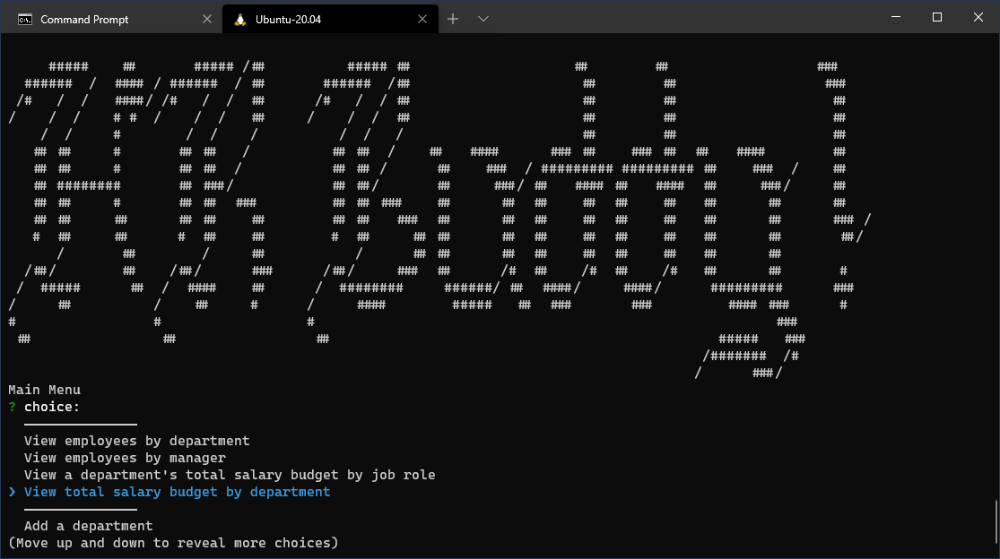

# HR Buddy

## Description

Featuring a simple, easy to use menu based interface, HR Buddy lets you keep track of your employees and manage your salary budget from the command line. Watch a video walkthrough of HR Buddy in action [here](https://youtu.be/jWKBKLrWWz0)!

## Installation & Usage

- Download or clone this repository into a directory on your computer
- Run npm install in that directory
- Launch the program by running node

## License

---

Copyright 2020 gminteer@gmail.com

Licensed under the Apache-2.0 License (the "License");
you may not use this file except in compliance with the License.
You may obtain a copy of the License at

<http://opensource.org/licenses/Apache-2.0>

Unless required by applicable law or agreed to in writing, software
distributed under the License is distributed on an "AS IS" BASIS,
WITHOUT WARRANTIES OR CONDITIONS OF ANY KIND, either express or implied.
See the License for the specific language governing permissions and
limitations under the License.
